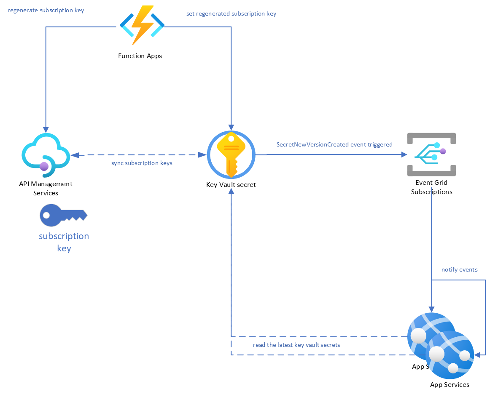
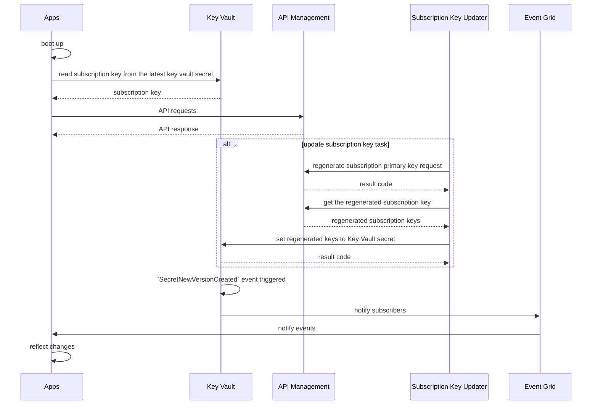

# Rotate subscription keys for API Management

Code snippets to rotate subscription keys for API Management.

## Prerequisites

- Python
- Azure Resources
  - Key Vault
  - API Management

## Architecture

### Components



### Sequence Diagram

- [Creating Mermaid diagrams](https://docs.github.com/en/get-started/writing-on-github/working-with-advanced-formatting/creating-diagrams#creating-mermaid-diagrams)



## Development

### Prepare Service Principal

To run the code, you need to create a service principal and assign roles to it.
Refer to the following links for more information.

- [Create an Azure service principal with Azure CLI](https://learn.microsoft.com/en-us/cli/azure/azure-cli-sp-tutorial-1?tabs=bash)
- [Service Principal az cli login failing - NO subscriptions found](https://stackoverflow.com/questions/55457349/service-principal-az-cli-login-failing-no-subscriptions-found)

For example, you can create a service principal with the following commands.

```shell
servicePrincipalName="your-sp-name"
roleName="contributor"
subscriptionID=$(az account show --query id --output tsv)
# Verify the ID of the active subscription
echo "Using subscription ID $subscriptionID"
resourceGroup="your-rg-name"

echo "Creating SP for RBAC with name $servicePrincipalName, with role $roleName and in scopes /subscriptions/$subscriptionID/resourceGroups/$resourceGroup"
az ad sp create-for-rbac --name $servicePrincipalName --role $roleName --scopes /subscriptions/$subscriptionID/resourceGroups/$resourceGroup
```

If you create a service principal successfully, following JSON will be returned.

```json
{
  "appId": "your-app-id",
  "displayName": "your-display-name",
  "password": "your-password",
  "tenant": "your-tenant-id"
}
```

Then, you can use the following command to log in with the service principal with password-based authentication.
Please refer to the following link for more information.

- [Use an Azure service principal with password-based authentication](https://learn.microsoft.com/en-us/cli/azure/azure-cli-sp-tutorial-2)

For example, you can log in with the service principal with the following command.

```shell
az login --service-principal \
         --username $appId \
         --password $password \
         --tenant $tenant
```

To run the code, you need to assign roles to the service principal.
It would be easier to use Azure Portal to assign roles to the service principal.
See the following links for more information.

- [Unable to create secrets in Azure Key Vault if using Azure role-based access control](https://stackoverflow.com/a/69971679)

### Infrastructure

WIP: add Bicep codes to [infra/](./infra) directory.

### Run commands via Python scripts

To see the details of the commands, see [main.py](./main.py).
Use the following command to see the help message.

**Help**

```shell
❯ python main.py --help
Usage: main.py [OPTIONS] COMMAND [ARGS]...

Options:
  --install-completion [bash|zsh|fish|powershell|pwsh]
                                  Install completion for the specified shell.
  --show-completion [bash|zsh|fish|powershell|pwsh]
                                  Show completion for the specified shell, to
                                  copy it or customize the installation.
  --help                          Show this message and exit.

Commands:
  get-key-vault-secret
  list-api-management-secrets
  regenerate-api-management-primary-key
  set-key-vault-secret
```

**Set KeyVault secret**

- [Quickstart: Azure Key Vault secret client library for Python](https://learn.microsoft.com/en-us/azure/key-vault/secrets/quick-create-python?tabs=azure-cli)

```shell
❯ python main.py set-key-vault-secret \
  --key-vault-name "name" \
  --key-vault-secret-name "secret-name" \
  --key-vault-secret-value "secret-value"
```

**Get KeyVault secret**

- [Quickstart: Azure Key Vault secret client library for Python](https://learn.microsoft.com/en-us/azure/key-vault/secrets/quick-create-python?tabs=azure-cli)

```shell
❯ python main.py get-key-vault-secret \
  --key-vault-name "name" \
  --key-vault-secret-name "secret-name" \
  --key-vault-secret-version "00000000"
```

**Regenerate API Management primary subscription key**

- [Subscription - Regenerate Primary Key](https://learn.microsoft.com/en-us/rest/api/apimanagement/subscription/regenerate-primary-key?view=rest-apimanagement-2022-08-01&tabs=Python#apimanagementsubscriptionregenerateprimarykey)

```shell
subscriptionId=$(az account show --query id --output tsv)
resourceGroupName="your-resource-group-name"
apiManagementName="your-api-management-name"
apiManagementSubscriptionId="your-api-management-subscription-id"

python main.py regenerate-api-management-primary-key \
  --subscription-id $subscriptionId \
  --resource-group-name $resourceGroupName \
  --api-management-name $apiManagementName \
  --api-management-subscription-id $apiManagementSubscriptionId
```

**List API Management secrets**

- [Subscription - List Secrets](https://learn.microsoft.com/en-us/rest/api/apimanagement/subscription/list-secrets?view=rest-apimanagement-2022-08-01&tabs=Python#apimanagementsubscriptionlistsecrets)

```shell
subscriptionId=$(az account show --query id --output tsv)
resourceGroupName="your-resource-group-name"
apiManagementName="your-api-management-name"
apiManagementSubscriptionId="your-api-management-subscription-id"

python main.py list-api-management-secrets \
  --subscription-id $subscriptionId \
  --resource-group-name $resourceGroupName \
  --api-management-name $apiManagementName \
  --api-management-subscription-id $apiManagementSubscriptionId
```

# References

- [How to auto rotate an API subscription key in Azure](https://learn.microsoft.com/en-us/answers/questions/963672/how-to-auto-rotate-an-api-subscription-key-in-azur)
